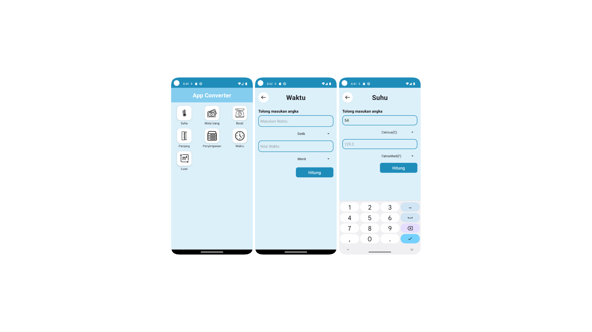

# MOBILE_10122106_ZAIDANABDULAZIZ_PABCL2024
 Tugas Codelabs 2024 Android
## Sample Picture

## Deskripsi
Membuat Aplikasi Unit Converter menggunakan android dengan bahasa Kotlin
## Refrensi
- Desain aplikasi terinspirasi dari [All-in-one Calculator](https://www.allinonecalculator.com/)
- Untuk icon sendiri tidak membuat sendiri melainkan dari [Flaticon](https://www.flaticon.com/)
